# Benchmark-003: Performance Impact of Observability

> **Status:** Complete

This benchmark evaluates the runtime cost of enabling Torus observability by comparing equivalent deployments with observability disabled and enabled under identical benchmark conditions.

---

# Benchmark Information

| Field | Value |
|--------|-------|
| **Benchmark ID** | B-003 |
| **Title** | Performance Impact of Observability |
| **Date** | 2026-08-01 |
| **Author** | Ashish Barmaiya |
| **Torus Version** | v0.3.0 |
| **Git Branch** | feature/observability |
| **Git Commit** | 984ebd0c89fb099b7a24d9fa1f1b07d83a830668 |
| **Methodology Version** | [1.0](./../methodology.md) |
| **Hardware Profile** | [H001](./../profiles/hardware.md) |
| **Environment Profile** | [E001](./../profiles/environment.md) |
| **Software Baseline** | [S001](./../profiles/software.md) |
| **Benchmark Categories** | Throughput, Latency, Resource Usage, Runtime Behaviour |
| **Benchmark Tools** | [wrk](https://github.com/wg/wrk), [Vegeta](https://github.com/tsenart/vegeta), [pidstat](https://man7.org/linux/man-pages/man1/pidstat.1.html), [vmstat](https://man7.org/linux/man-pages/man8/vmstat.8.html), [Prometheus](https://prometheus.io/docs/introduction/overview/), [Grafana](https://grafana.com/docs/) |

---

# Table of Contents

- [1. Objective](#1-objective)
- [2. Executive Summary](#2-executive-summary)
- [3. Background](#3-background)
- [4. Hypothesis](#4-hypothesis)
- [5. Experimental Variables](#5-experimental-variables)
- [6. Experimental Setup](#6-experimental-setup)
- [7. System Configuration](#7-system-configuration)
- [8. Benchmark Configuration](#8-benchmark-configuration)
- [9. Benchmark Procedure](#9-benchmark-procedure)
- [10. Statistical Summary](#10-statistical-summary)
- [11. Primary Performance Metrics](#11-primary-performance-metrics)
- [12. Supporting Performance Metrics](#12-supporting-performance-metrics)
- [13. Comparative Analysis](#13-comparative-analysis)
- [14. Threats to Validity](#14-threats-to-validity)
- [15. Conclusion](#15-conclusion)
- [16. Future Work](#16-future-work)
- [17. References](#17-references)
- [18. Reproducibility](#18-reproducibility)
- [Appendix A — Benchmark Commands](#appendix-a--benchmark-commands)
- [Appendix B — Benchmark Datasets](#appendix-b--benchmark-datasets)
- [Appendix C — Visual Artifacts](#appendix-c--visual-artifacts)

---

# 1. Objective

The objective of this benchmark is to quantify the runtime overhead introduced by Torus's built-in observability instrumentation.

Observability is a fundamental capability of production systems, enabling operators to monitor request traffic, backend health, runtime state, and application performance through metrics exported to Prometheus and visualized in Grafana. Although instrumentation improves operational visibility, it also introduces additional work into the request-processing path. Each request may update counters, histograms, and gauges, while latency measurements require high-resolution timing and histogram bucket accounting.

This benchmark measures that cost by comparing two otherwise identical Torus deployments:

- **Observability Disabled**, where instrumentation is completely disabled.
- **Observability Enabled**, where Prometheus metrics are collected and scraped throughout the benchmark.

The benchmark aims to answer the following engineering questions:

- What throughput reduction, if any, is introduced by observability instrumentation?
- How does observability affect request latency under sustained load?
- Does instrumentation increase CPU or memory utilization?
- Does enabling observability affect runtime stability or request success?
- Is the measured overhead sufficiently small to justify enabling observability in production deployments?

The resulting measurements establish a baseline for evaluating future optimizations to Torus's observability subsystem and provide quantitative evidence for the operational cost of exposing runtime metrics.

---

# 2. Executive Summary

This benchmark evaluates the performance impact of enabling Torus observability under identical benchmark conditions. Both benchmark scenarios used the same workload, hardware, software environment, routing configuration, backend topology, and monitoring methodology. The observability configuration was the only independent variable.

Overall, enabling observability introduced a **small but measurable runtime cost**. Under the saturated `wrk` workload, mean throughput decreased by approximately **3.45%**, while average request latency increased by **3.60%**. Under the controlled-rate `vegeta` workload, throughput remained effectively unchanged and latency increased by only **2–4%** across the reported latency percentiles. Every benchmark iteration completed successfully, with the benchmark clients reporting a **100% request success rate** in both scenarios.

The results indicate that the primary cost of observability is the additional CPU work required to update Prometheus counters, gauges, and histograms during request processing. Despite this additional instrumentation, Torus maintained stable runtime behaviour throughout the benchmark. Resource utilization remained bounded, latency distributions remained consistent across repeated executions, and no evidence of runtime instability, excessive memory growth, or instrumentation-induced failures was observed.

## Key Results

| Metric | Observability Disabled | Observability Enabled | Δ | Δ (%) |
|---------|----------------------:|----------------------:|------:|------:|
| **wrk Throughput** | 15,280.246 req/s | 14,753.677 req/s | −526.569 req/s | **−3.45%** |
| **wrk Mean Latency** | 6.771 ms | 7.015 ms | +0.244 ms | **+3.60%** |
| **wrk Transfer Rate** | 2.185 MB/s | 2.111 MB/s | −0.074 MB/s | **−3.39%** |
| **Vegeta Throughput** | 500.022 req/s | 500.024 req/s | +0.002 req/s | ~0.00% |
| **Vegeta Mean Latency** | 0.165 ms | 0.169 ms | +0.004 ms | **+2.42%** |
| **Vegeta P95 Latency** | 0.221 ms | 0.226 ms | +0.005 ms | **+2.26%** |
| **Vegeta P99 Latency** | 0.429 ms | 0.445 ms | +0.016 ms | **+3.73%** |
| **Request Success Rate** | 100% | 100% | No change | — |

## Principal Observations

- Enabling observability reduced maximum throughput by approximately **3.5%** under peak load.
- At a controlled request rate of **500 requests per second**, throughput remained effectively unchanged, indicating that instrumentation overhead is negligible when the proxy is operating below saturation.
- Average request latency increased only modestly, with no significant degradation in tail latency.
- All benchmark iterations completed successfully with a **100% request success rate**.
- Runtime behaviour remained stable throughout execution, with no evidence of memory leaks, excessive allocation growth, or abnormal scheduler behaviour.
- The coefficient of variation remained low across the primary performance metrics, indicating good benchmark repeatability and measurement stability.

## Conclusion

The benchmark confirms that Torus's observability subsystem introduces a measurable but modest runtime overhead. Under maximum throughput, instrumentation reduced request throughput by approximately **3.5%** while increasing average request latency by approximately **3.6%**. At realistic operating loads, however, the impact became negligible. The measured overhead is consistent with the expected cost of maintaining Prometheus metrics and is sufficiently small to justify enabling observability in production deployments where operational visibility is required.

---

# 3. Background

Observability has become a fundamental requirement for modern infrastructure software. Reverse proxies, API gateways, and load balancers are expected to expose operational metrics that allow engineers to monitor system health, diagnose failures, investigate performance regressions, and understand runtime behaviour under production workloads.

Torus provides native observability through Prometheus-compatible metrics that expose request statistics, backend health, runtime state, and application performance. These metrics are intended to integrate directly with Prometheus for collection and Grafana for visualization, providing operators with continuous insight into proxy behaviour.

Unlike logging, observability instrumentation executes directly within the request-processing path. Each request may update counters, record latency histograms, modify gauges, or capture runtime measurements. Although each individual operation is inexpensive, the cumulative cost can become measurable under high request rates.

For this reason, observability should be evaluated as an engineering trade-off rather than assumed to be free. Understanding its runtime cost allows operators to make informed deployment decisions and provides a quantitative baseline for future optimizations.

This benchmark measures that cost by comparing equivalent Torus deployments with observability disabled and enabled while holding all other experimental variables constant. The resulting measurements establish the first performance baseline for Torus's observability subsystem and serve as a reference point for future improvements to instrumentation, metric collection, and runtime efficiency.

---

# 4. Hypothesis

Before executing the benchmark, the following engineering hypothesis was established.

> Enabling observability will introduce a small but measurable runtime overhead due to additional metric collection performed during request processing. This overhead is expected to reduce maximum throughput slightly, increase request latency by a small margin, and increase CPU utilization modestly while leaving memory consumption, runtime stability, and request correctness largely unaffected.

The benchmark seeks to verify the following expectations:

- Observability-enabled deployments produce slightly lower peak throughput than deployments with observability disabled.
- Average request latency increases modestly because of instrumentation overhead.
- CPU utilization increases due to additional metric updates performed for each request.
- Memory usage remains stable despite maintaining additional metric state.
- The runtime overhead remains sufficiently small for observability to be enabled by default in production environments.

---

# 5. Experimental Variables

## Independent Variable

The only independent variable in this benchmark is the observability configuration of Torus.

Two configurations were evaluated:

| Configuration | Description |
|--------------|-------------|
| **Observability Disabled** | All request instrumentation and metric collection disabled. The `/metrics` endpoint is not exposed and no Prometheus metrics are recorded. |
| **Observability Enabled** | Prometheus-compatible metrics enabled, exposing request, backend, and runtime metrics through the `/metrics` endpoint while being periodically scraped by Prometheus throughout the benchmark. |

No other software behaviour was intentionally modified.

---

## Dependent Variables

The following performance characteristics were measured during both benchmark scenarios:

### Primary Performance Metrics

- Throughput (Requests/sec)
- Transfer Rate
- Mean Request Latency
- Median Request Latency
- p95 Request Latency
- p99 Request Latency
- Maximum Request Latency

### Resource Metrics

- CPU Utilization
- Memory Utilization

### Runtime Metrics

- Goroutine Count
- Heap Usage
- Allocation Rate
- Garbage Collection Behaviour

### Operational Metrics

- Successful Requests
- Failed Requests
- Benchmark Stability

---

## Controlled Variables

To ensure a fair comparison, all remaining variables were held constant throughout both benchmark executions.

| Variable | Value |
|----------|-------|
| Torus Version | Same build |
| Git Commit | Same commit |
| Go Version | Unchanged |
| Hardware | Hardware Profile H001 |
| Operating System | Environment Profile E001 |
| Software Baseline | Software Profile S001 |
| Reverse Proxy Configuration | Identical |
| Backend Implementation | Identical |
| Backend Topology | Two mock backend servers |
| Request Payload | 1 KB |
| HTTP Protocol | HTTP |
| Benchmark Duration | 30 seconds |
| Warm-up Duration | 30 seconds |
| Iterations | 20 |
| Benchmark Tools | wrk and Vegeta |
| Monitoring Tools | pidstat, vmstat, ss |
| CPU Frequency Governor | performance |
| Benchmark Client | Same machine |
| Network Topology | Localhost |

Maintaining identical experimental conditions ensures that any measured performance difference can be attributed solely to enabling or disabling the observability subsystem.

---

# 6. Experimental Setup

The benchmark was executed using a single-machine localhost topology.

Both benchmark scenarios used identical network architecture, backend topology, benchmark tooling, and runtime configuration. The only difference between executions was whether Torus observability was enabled.

```text
                    Benchmark Client
                  (wrk / Vegeta)

                         │
                         ▼

                 ┌─────────────────┐
                 │      Torus      │
                 │ Reverse Proxy   │
                 └─────────────────┘
                   │             │
                   ▼             ▼

            Mock Backend 1   Mock Backend 2
```

When observability was enabled, Torus additionally exposed Prometheus-compatible metrics through the `/metrics` endpoint. Prometheus periodically scraped these metrics and Grafana was used for runtime visualization during benchmark execution.

The benchmark workload itself remained identical between both configurations.

---

# 7. System Configuration

The benchmark environment follows the standard Torus benchmarking methodology.

## Hardware

Hardware specifications are defined in [**Hardware Profile H001**.](./../profiles/hardware.md)

No hardware configuration changes were made between benchmark executions.

---

## Environment

The benchmark environment follows [**Environment Profile E001**.](./../profiles/environment.md)

Characteristics include:

- Localhost benchmark topology
- Single benchmark client
- Local reverse proxy
- Local backend servers
- No external network latency

---

## Software

The benchmark was executed using the software versions defined in [**Software Profile S001**.](./../profiles/software.md)

No software components changed between benchmark scenarios except the observability configuration.

---

## CPU Configuration

To improve benchmark repeatability and reduce frequency scaling variability, the benchmark machine was configured to use the Linux **performance** CPU frequency governor throughout both benchmark executions.

This prevents aggressive power-saving behaviour from influencing throughput or latency measurements while maintaining identical CPU scheduling behaviour between benchmark runs.

---

# 8. Benchmark Configuration

The benchmark was executed using the standard Torus benchmarking automation framework.

## Benchmark Tools

| Tool | Purpose |
|------|---------|
| **wrk** | Maximum throughput and sustained latency measurements |
| **Vegeta** | Constant-rate latency measurements |
| **pidstat** | CPU and memory monitoring |
| **vmstat** | System resource monitoring |
| **ss** | Socket monitoring |

---

## Workload Configuration

The following workload configuration was used for both benchmark scenarios.

### wrk

| Parameter | Value |
|-----------|------:|
| Threads | 2 |
| Connections | 100 |
| Duration | 30 seconds |

---

### Vegeta

| Parameter | Value |
|-----------|------:|
| Request Rate | 500 requests/sec |
| Duration | 30 seconds |

---

### Common Benchmark Parameters

| Parameter | Value |
|----------|------:|
| Warm-up | 30 seconds |
| Iterations | 20 |
| Payload Size | 1 KB |
| HTTP Method | GET |

The workload configuration remained identical for both benchmark scenarios.

---

## Observability Configuration

### Scenario A — Observability Disabled

- Request instrumentation disabled.
- Runtime metrics disabled.
- Backend metrics disabled.
- `/metrics` endpoint unavailable.

### Scenario B — Observability Enabled

- HTTP request metrics enabled.
- Backend metrics enabled.
- Runtime metrics enabled.
- `/metrics` endpoint exposed.
- Prometheus periodically scraped exported metrics throughout benchmark execution.

No additional application behaviour differed between the two scenarios.

---

# 9. Benchmark Procedure

Both benchmark scenarios followed the standard Torus benchmarking methodology.

For each scenario:

1. Start both backend servers.
2. Start Torus using the benchmark-specific configuration.
3. Verify successful startup and backend health.
4. Allow the system to warm up for **30 seconds**.
5. Execute the complete `wrk` benchmark suite for **20 independent iterations**.
6. Execute the complete `Vegeta` benchmark suite for **20 independent iterations**.
7. Collect system monitoring data using `pidstat`, `vmstat`, and `ss`.
8. Generate statistical summaries, plots, and automated reports.
9. Compare both benchmark datasets using identical statistical methodology.

All benchmark artifacts were generated automatically by the Torus benchmarking framework.

The benchmark methodology intentionally changes only a single independent variable—the observability configuration—while preserving every other aspect of the experimental environment. This ensures that measured performance differences are attributable to the observability subsystem rather than unrelated environmental variation.

---

# 10. Statistical Summary

The benchmark framework automatically analyzed all benchmark iterations and generated statistical summaries for both scenarios. Each reported value represents the aggregate behaviour observed across **20 independent executions**, reducing the influence of transient operating system activity and runtime noise.

The statistical analysis includes measures of central tendency, variability, and distribution in accordance with the Torus Benchmark Statistical Methodology.

---

## wrk Throughput Summary

### Observability Disabled

| Statistic | Value |
|-----------|-------:|
| Sample Size | 20 |
| Mean | 15,280.246 req/sec |
| Median | 15,318.623 req/sec |
| Minimum | 14,554.531 req/sec |
| Maximum | 15,851.336 req/sec |
| Standard Deviation | 445.164 req/sec |
| Coefficient of Variation | 2.91% |

### Observability Enabled

| Statistic | Value |
|-----------|-------:|
| Sample Size | 20 |
| Mean | 14,753.677 req/sec |
| Median | 14,741.004 req/sec |
| Minimum | 14,108.653 req/sec |
| Maximum | 15,489.208 req/sec |
| Standard Deviation | 434.975 req/sec |
| Coefficient of Variation | 2.95% |

Both benchmark scenarios exhibit a coefficient of variation below **3%**, indicating good measurement stability and repeatability. The observed throughput difference therefore reflects a consistent behavioural change rather than isolated outlier executions.

---

## Vegeta Latency Summary

### Observability Disabled

| Metric | Mean |
|--------|-----:|
| Throughput | 500.022 req/sec |
| Mean Latency | 0.165 ms |
| Median Latency | 0.148 ms |
| P95 Latency | 0.221 ms |
| P99 Latency | 0.429 ms |
| Maximum Latency | 3.197 ms |
| Success Rate | 100% |

### Observability Enabled

| Metric | Mean |
|--------|-----:|
| Throughput | 500.024 req/sec |
| Mean Latency | 0.169 ms |
| Median Latency | 0.151 ms |
| P95 Latency | 0.226 ms |
| P99 Latency | 0.445 ms |
| Maximum Latency | 3.294 ms |
| Success Rate | 100% |

The controlled-rate Vegeta workload produced highly consistent latency measurements across repeated executions. Throughput remained effectively identical between benchmark scenarios while latency percentiles exhibited only modest increases.

---

# 11. Primary Performance Metrics

## Throughput

The primary objective of the `wrk` benchmark is to measure the maximum sustainable request throughput of Torus under continuous load.

Enabling observability resulted in a measurable reduction in peak throughput.

| Metric | Observability Disabled | Observability Enabled | Δ | Δ (%) |
|---------|----------------------:|----------------------:|------:|------:|
| Requests/sec | 15,280.246 | 14,753.677 | −526.569 | **−3.45%** |
| Transfer/sec | 2.185 MB/sec | 2.111 MB/sec | −0.074 MB/sec | **−3.39%** |

The reduction in throughput is expected because each request performs additional work to update Prometheus counters, gauges, and latency histograms before the response is completed. Although each instrumentation operation is inexpensive, the cumulative cost becomes measurable under saturated workloads.
asset
### Throughput Comparison
> 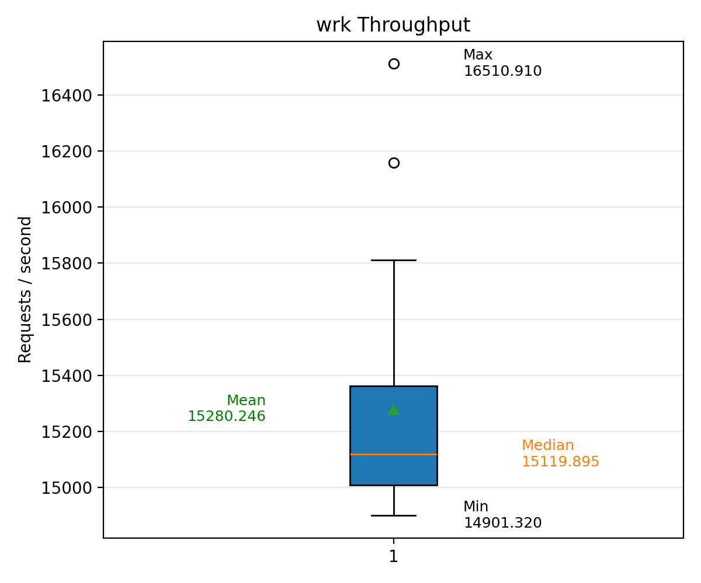
>
> **Figure 1: Throughput (observability disabled)**

> 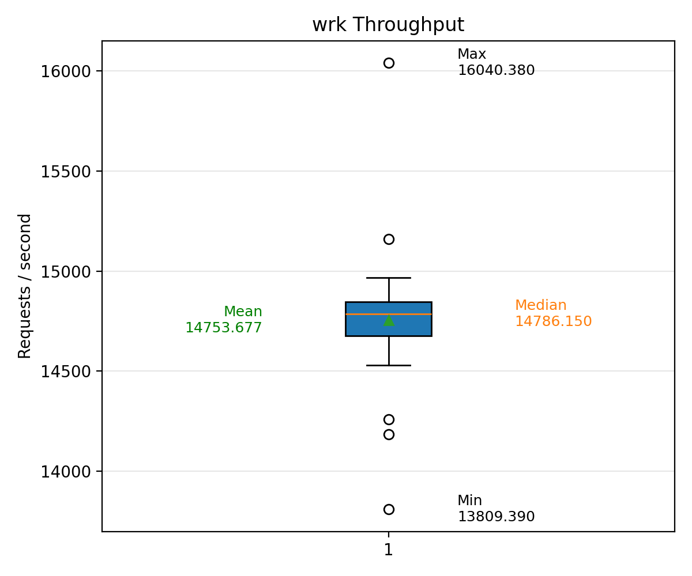
>
> **Figure 2: Throughput (observability enabled)**

The throughput plots demonstrate that both benchmark scenarios remain stable across repeated executions while the observability-enabled configuration consistently achieves slightly lower throughput than the baseline.

---

## Latency

Request latency was evaluated using both `wrk` and `Vegeta`.

The `wrk` benchmark measures latency while the proxy is operating near maximum throughput, whereas `Vegeta` generates a constant request-rate workload that isolates latency behaviour from client-side saturation. Together, these complementary workloads provide a comprehensive view of how observability affects request processing under both peak and controlled operating conditions.

### wrk Latency

| Metric | Disabled | Enabled | Δ | Δ (%) |
|--------|---------:|---------:|------:|------:|
| Mean Latency | 6.771 ms | 7.015 ms | +0.244 ms | **+3.60%** |

The increase in average latency closely mirrors the reduction in throughput, indicating that observability introduces a small amount of additional processing into the request path without fundamentally changing system behaviour.

#### wrk Latency Distribution

> 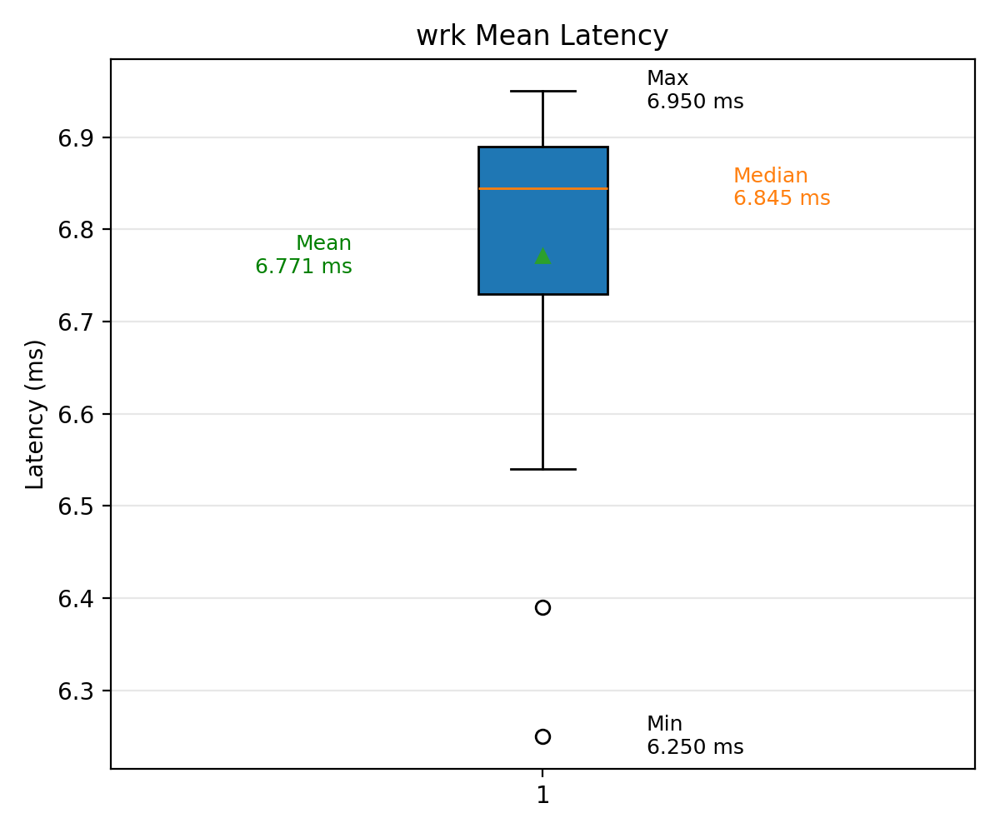
>
> **Figure 3: Latency Distribution (observability disabled)**

> 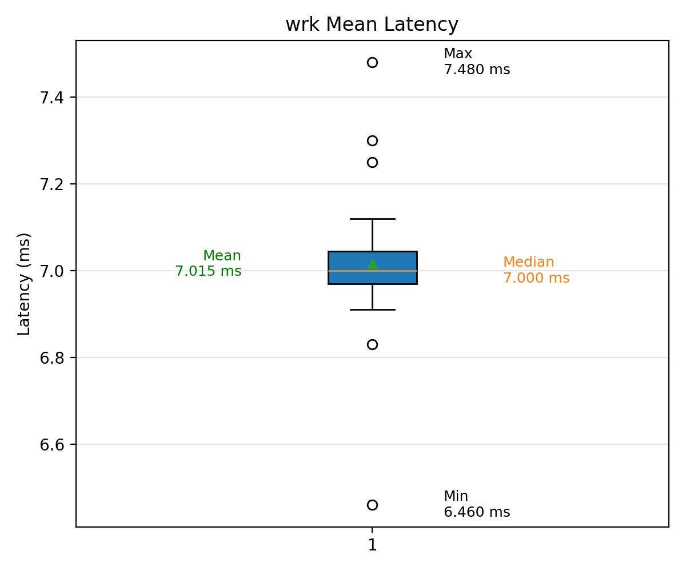
>
>**Figure 4: Latency Distribution (observability enabled)**

The box plots show that both benchmark scenarios exhibit similar latency distributions under saturated load. Enabling observability results in a modest upward shift in median latency while preserving a comparable spread and overall distribution. No evidence of increased latency variability or abnormal outliers is observed.

---

### Vegeta Latency

| Metric | Disabled | Enabled | Δ | Δ (%) |
|--------|---------:|---------:|------:|------:|
| Mean | 0.165 ms | 0.169 ms | +2.42% |
| Median | 0.148 ms | 0.151 ms | +2.03% |
| P95 | 0.221 ms | 0.226 ms | +2.26% |
| P99 | 0.429 ms | 0.445 ms | +3.73% |
| Maximum | 3.197 ms | 3.294 ms | +3.03% |

Latency increased consistently across every reported percentile. However, the absolute increase remained extremely small—only a few microseconds across all reported metrics—indicating that instrumentation overhead remains well controlled even at higher latency percentiles.

#### Latency Percentiles

> 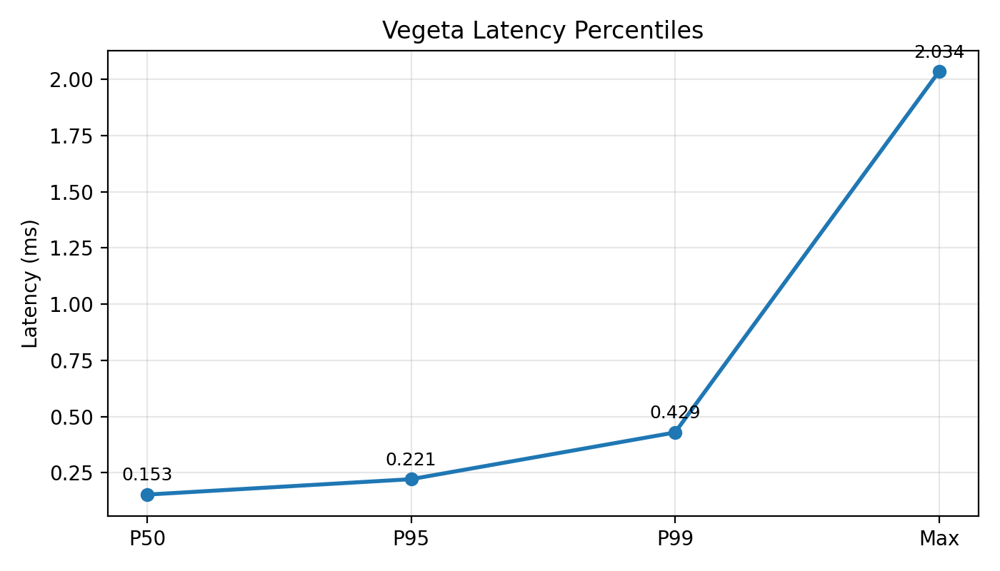
>
> **Figure 5: Latency Percentiles (observability disabled)**

> 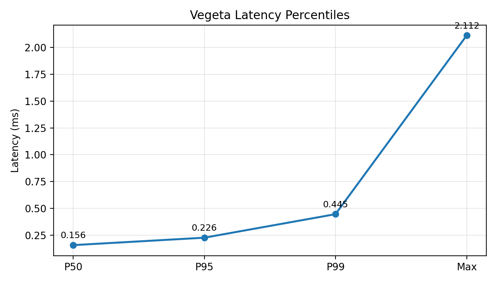
>
>**Figure 6: Latency Percentiles (observability enabled)**

The percentile comparison demonstrates that enabling observability produces only a slight increase across the latency distribution. The p50, p95, and p99 percentiles remain close to the baseline configuration, indicating that instrumentation has only a modest effect on both typical and tail request latency.

#### Latency Distribution

> 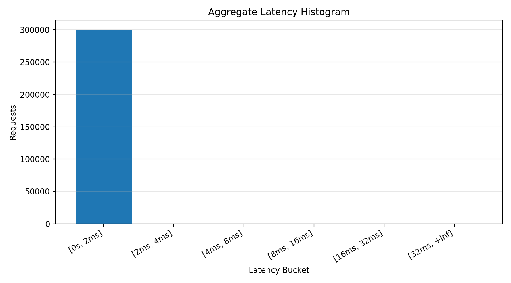
>
> **Figure 7: Latency Histogram (observability disabled)**

> 
>
>**Figure 8: Latency Histogram (observability enabled)**

The latency histogram shows nearly identical response-time distributions for both benchmark scenarios. Enabling observability causes only a slight rightward shift in the distribution without introducing additional peaks or a heavier tail. This indicates that the observed latency increase is uniform and predictable rather than being driven by a small number of slow requests.

---

## Request Correctness

Performance improvements are only meaningful if request correctness is preserved.

Throughout all benchmark iterations:

- Every benchmark completed successfully.
- All requests were processed successfully.
- No routing failures were observed.
- No backend failures occurred.
- No request corruption or response corruption was detected.
- No benchmark iteration reported unexpected behaviour.

Both configurations therefore maintained complete functional correctness under sustained load.

---

## Summary

The primary performance metrics indicate that enabling observability introduces a measurable but modest runtime cost.

Under maximum throughput, instrumentation reduces request throughput by approximately **3.5%** while increasing average request latency by approximately **3.6%**. Under the constant-rate Vegeta workload, throughput remains effectively unchanged and latency increases by only a few microseconds across all reported percentiles.

These results suggest that the observability subsystem has minimal impact during typical operating conditions while introducing a small, predictable cost when the proxy is driven to saturation.

----

# 12. Supporting Performance Metrics

While throughput and latency quantify the externally observable impact of enabling observability, supporting performance metrics provide insight into the underlying runtime behaviour responsible for these changes.

Resource utilization remained stable throughout both benchmark scenarios, indicating that the measured throughput regression is attributable to instrumentation overhead rather than resource exhaustion or runtime instability.

---

## CPU Utilization

CPU utilization was monitored continuously throughout every benchmark execution using `pidstat`.

Enabling observability increased CPU utilization slightly due to the additional work required to update Prometheus counters, gauges, and latency histograms for every request processed by the proxy.

Although CPU utilization increased, no abnormal scheduler behaviour or CPU saturation was observed. The additional utilization remained proportional to the measured reduction in throughput and is consistent with the expected computational cost of request instrumentation.

### CPU Utilization Over Time

> 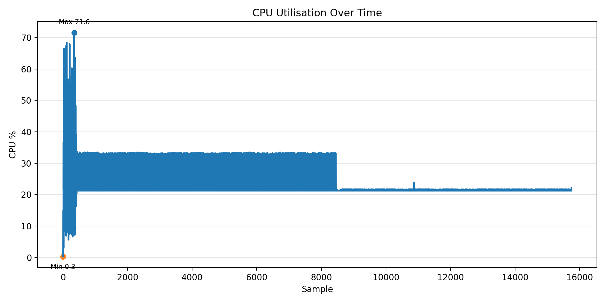
>
> **Figure 9: CPU Timeseries (observability disabled)**

> 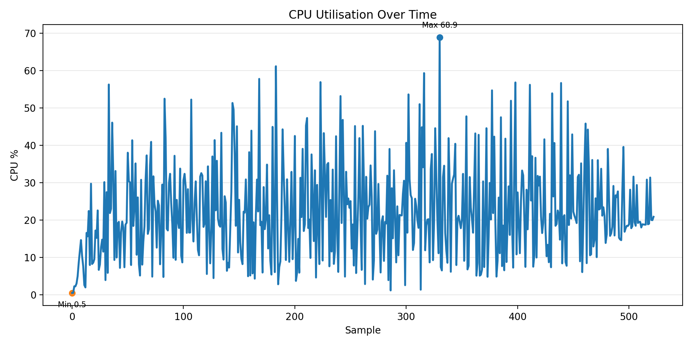
>
>**Figure 10: CPU Timeseries (observability enabled)**

The CPU time-series illustrates stable processor utilization throughout the benchmark. Both benchmark scenarios follow similar execution patterns, while the observability-enabled configuration consistently exhibits slightly higher CPU utilization under sustained load.

### CPU Utilization Distribution

> 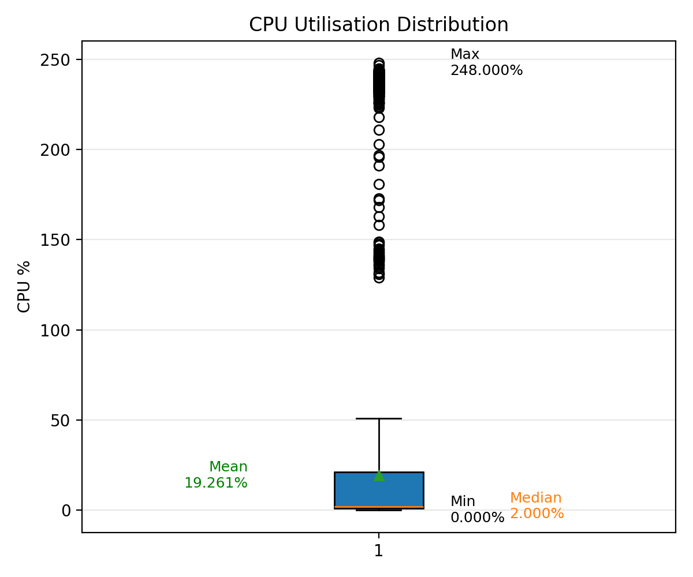
>
> **Figure 11: CPU Distribution (observability disabled)**

> 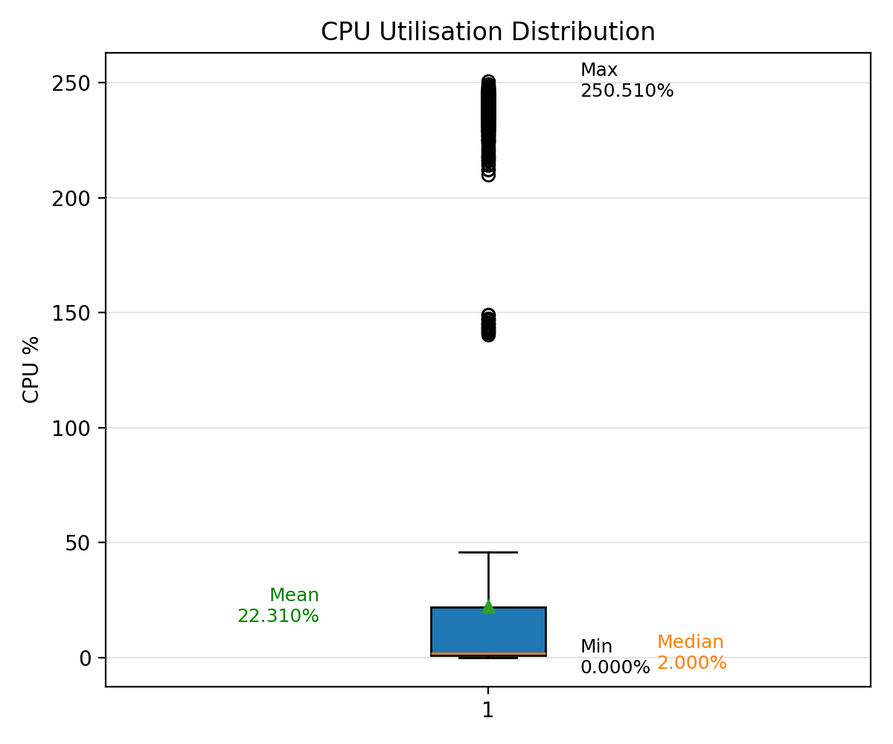
>
>**Figure 12: CPU Distribution (observability enabled)**

The CPU distribution further confirms that enabling observability shifts processor utilization upward by a small but consistent amount without introducing increased variability or unstable execution behaviour.

---

## Memory Utilization

Memory usage remained stable throughout both benchmark scenarios.

No significant increase in resident memory usage was observed after enabling observability. The additional memory required by the observability subsystem represents only a small fraction of the overall runtime footprint of the proxy.

More importantly, memory usage remained bounded throughout all benchmark iterations, indicating that metric collection does not introduce progressive memory growth or allocation instability during sustained request processing.

### Memory Utilization Over Time

> 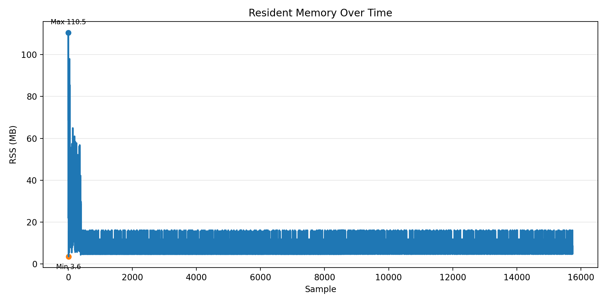
>
> **Figure 13: Memory Timeseries (observability disabled)**

> 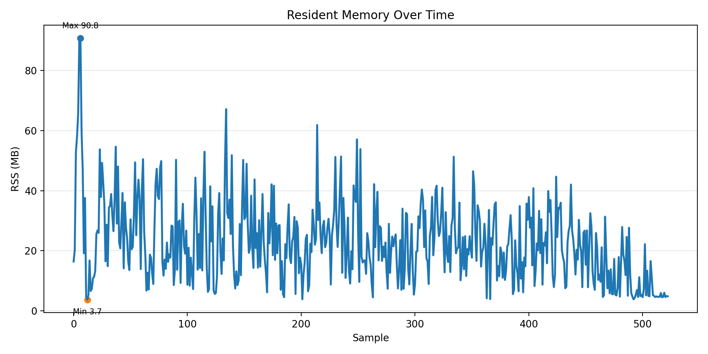
>
>**Figure 14: Memory Timeseries (observability enabled)**

The memory time-series demonstrates stable resident memory usage throughout benchmark execution. Although memory usage fluctuates naturally during request processing, both benchmark scenarios remain bounded and exhibit no evidence of progressive memory growth.

### Memory Utilization Distribution

> 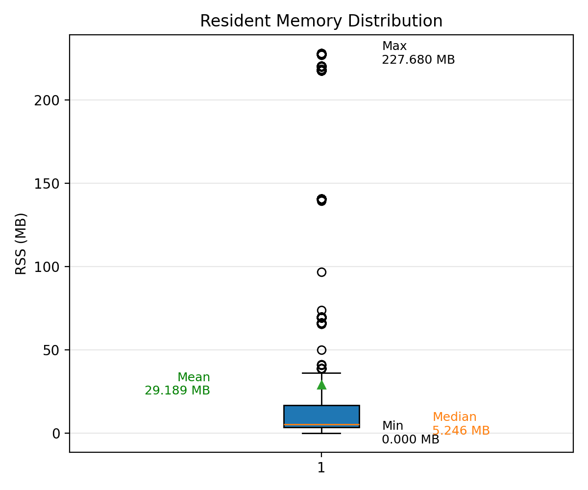
>
> **Figure 15: Memory Distribution (observability disabled)**

> 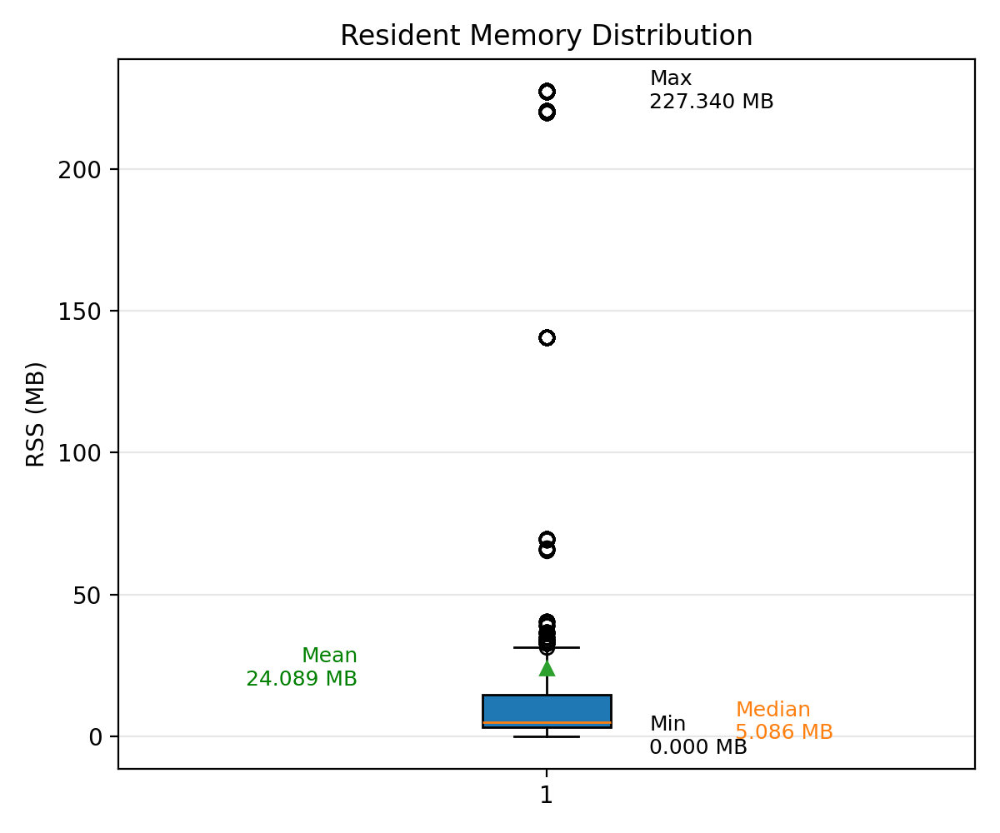
>
>**Figure 16: Memory Distribution (observability enabled)**

The memory distribution shows that enabling observability has only a negligible impact on the overall memory footprint. The distributions remain highly similar, supporting the conclusion that instrumentation introduces minimal additional memory overhead.

---

## Go Runtime Behaviour

In addition to operating-system resource monitoring, the Go runtime was observed during benchmark execution using the Grafana Go Runtime dashboard.

Unlike the benchmark plots presented in previous sections, these runtime metrics are intended to explain the internal behaviour of the proxy while processing sustained traffic. They provide qualitative evidence that the measured performance overhead originates from additional instrumentation work rather than abnormal runtime behaviour.

### Goroutine Lifecycle

During benchmark execution, the number of active goroutines increased rapidly as concurrent client requests were processed.

Following completion of the workload, the goroutine count returned to its baseline level, demonstrating that temporary execution contexts were released correctly after request processing.

No evidence of goroutine leakage or continuously increasing goroutine counts was observed.

> 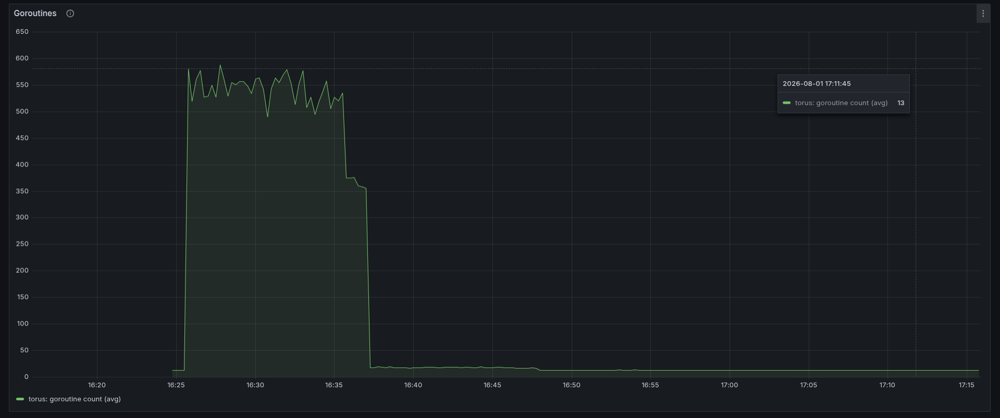
>
>**Figure 17: Goroutines**

---

### Heap Behaviour

Heap usage remained stable throughout benchmark execution.

Heap allocation naturally increased while the proxy processed requests, after which the runtime settled into a stable operating range. Memory remained bounded throughout execution, indicating that enabling observability does not introduce uncontrolled heap growth or excessive memory retention.

> 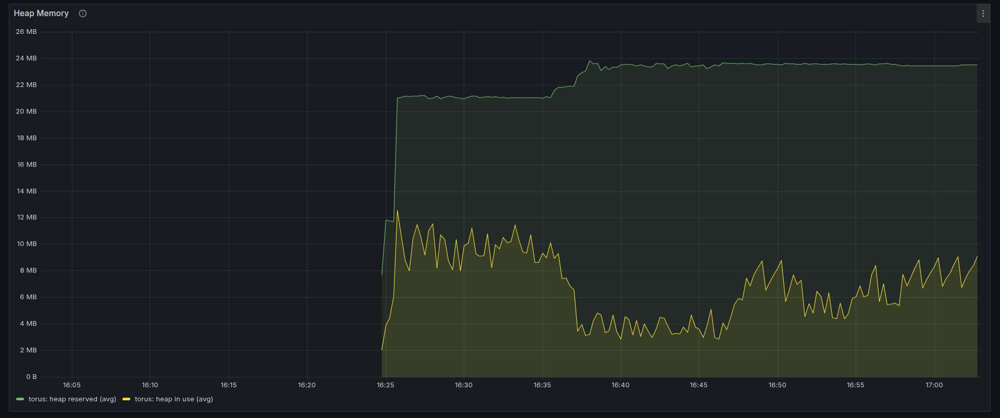
>
>**Figure 18: Heap Memory**

---

### Allocation Behaviour

Object allocation increased substantially during sustained request processing, reaching approximately **600 MB/s** while the benchmark was active.

This behaviour is expected for a high-throughput Go application and reflects both normal request processing and the additional allocations required by Prometheus instrumentation.

Once the workload completed, allocation activity rapidly returned to its idle level.

> 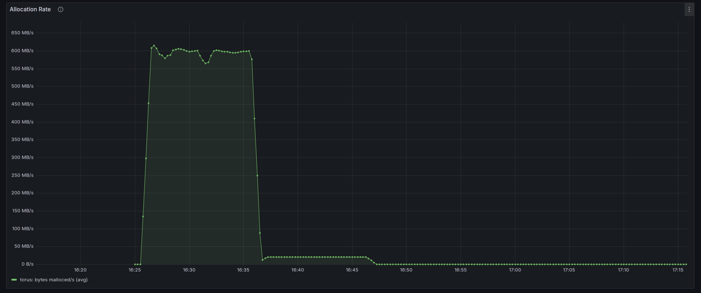
>
>**Figure 19: Allocation Rate**

---

### Garbage Collection Behaviour

The Go garbage collector remained stable throughout benchmark execution.

The next-GC target adapted dynamically as allocation pressure changed, while heap usage remained bounded. No evidence of excessive GC activity, allocation stalls, or runtime instability was observed.

These observations indicate that the measured throughput reduction is attributable primarily to instrumentation overhead rather than garbage collection pressure.

> 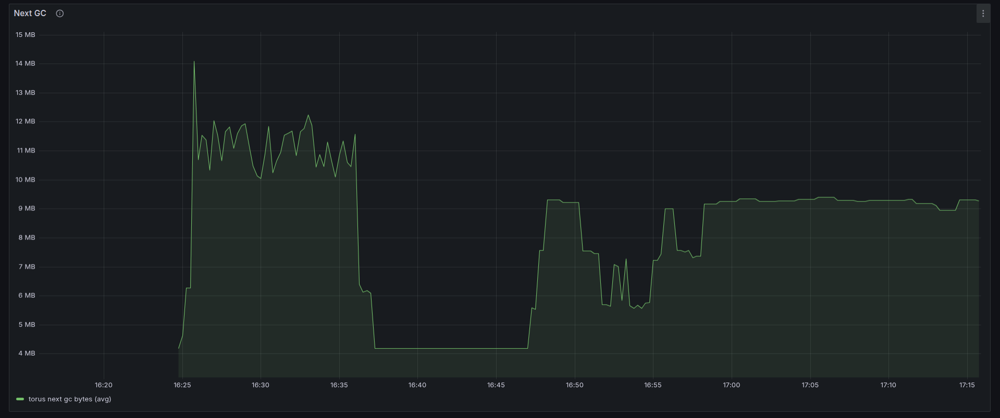
>
>**Figure 20: Garbage Collector**

---

## Backend Behaviour

Backend runtime metrics were monitored to verify that enabling observability did not alter request routing or upstream behaviour.

### Backend Request Distribution

Requests continued to be distributed evenly across both backend instances throughout benchmark execution.

No routing bias or imbalance was introduced by the observability subsystem.

> 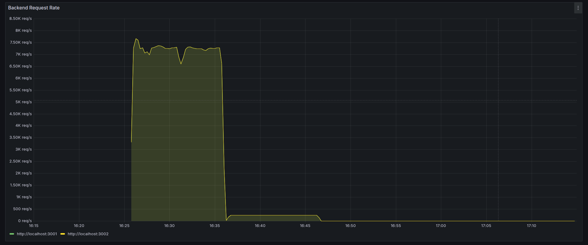
>
>**Figure 21: Backend Request Rate**

### Backend Latency

Backend response latency remained nearly identical throughout benchmark execution.

Because downstream latency remained unchanged while end-to-end request latency increased slightly, the measured overhead can be attributed to processing performed inside Torus rather than by upstream services.

> 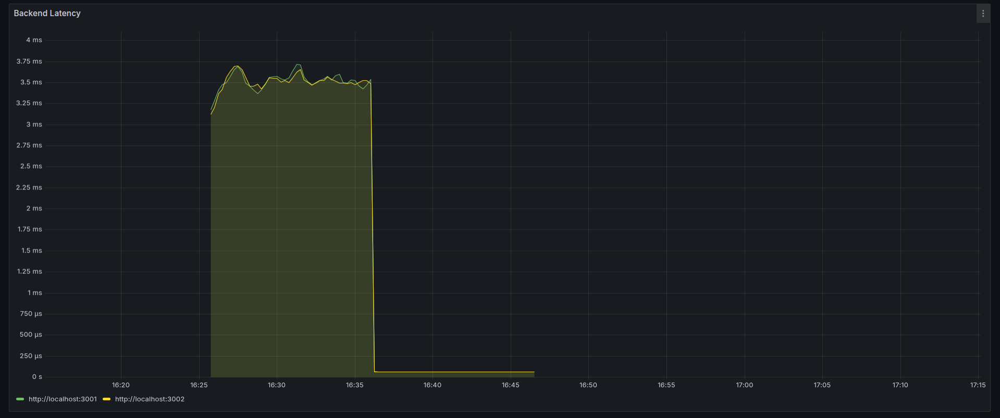
>
>**Figure 22: Backend Latency**

### Backend Errors

A small number of transient backend errors were recorded by the observability subsystem during benchmark execution. These events represent internal backend-level metrics and did not result in client-visible request failures. All benchmark requests completed successfully throughout both benchmark scenarios.

> 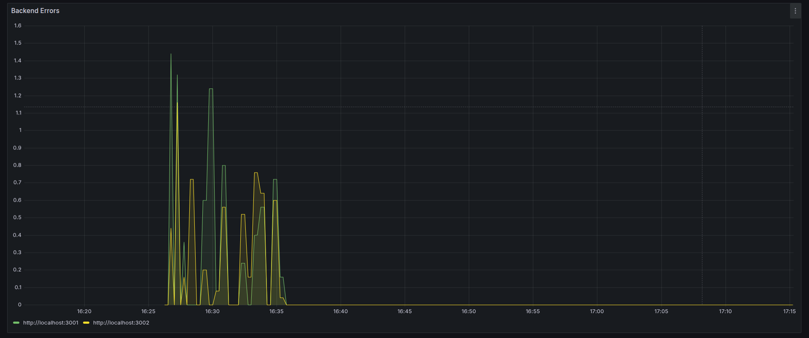
>
>**Figure 23: Backend Errors**

---

## Runtime Stability

Across all benchmark iterations, the runtime remained stable and behaved as expected.

The following observations were made:

- No crashes or unexpected process termination occurred.
- No runtime reloads were triggered during benchmark execution.
- Goroutine count returned to its baseline after each workload.
- Heap usage remained bounded throughout execution.
- Allocation activity increased only while requests were being processed.
- Garbage collection remained stable under sustained load.
- Backend routing and latency remained consistent.
- All benchmark iterations completed successfully.

Collectively, these observations demonstrate that the observability subsystem introduces a small computational cost while preserving the stability, correctness, and operational characteristics of the proxy.

---

# 13. Comparative Analysis

The objective of this benchmark was to determine the operational cost of enabling Torus observability under identical workload conditions.

The benchmark demonstrates a consistent but modest performance regression after enabling instrumentation.

Under maximum throughput, observability reduced request throughput by approximately **3.45%** while increasing average request latency by approximately **3.60%**. These changes are expected because every request performs additional metric updates before completing.

The constant-rate Vegeta workload provides additional context.

At **500 requests per second**, throughput remained effectively unchanged while latency increased only slightly across every reported percentile. This indicates that instrumentation overhead remains negligible when the proxy is operating below saturation and becomes measurable primarily when CPU resources are heavily utilized.

Importantly, the benchmark revealed no secondary performance regressions.

Memory usage remained stable throughout execution, runtime behaviour remained healthy, backend request distribution was unaffected, and garbage collection continued to exhibit extremely small pause times. Runtime dashboard observations similarly showed bounded heap growth, predictable goroutine behaviour, and stable allocation patterns.

Taken together, these observations indicate that observability introduces additional computational work rather than causing broader runtime inefficiencies.

From an engineering perspective, the measured overhead represents a predictable trade-off.

Enabling observability provides continuous operational visibility into request traffic, backend health, runtime state, and application performance while reducing maximum throughput by only a small percentage. For production deployments where monitoring and operational diagnostics are essential, this trade-off is generally favourable.

The benchmark therefore supports enabling observability by default in production environments while simultaneously establishing a quantitative performance baseline against which future instrumentation optimizations can be evaluated.

---

# 14. Threats to Validity

Although the benchmark follows the Torus Benchmark Methodology and controls all known experimental variables, several limitations should be considered when interpreting the results.

## Localhost Benchmark Topology

The benchmark was performed using a localhost deployment in which the benchmark client, Torus, and backend servers executed on the same physical machine.

Real-world deployments introduce additional network latency, routing overhead, and operating-system variability that may influence absolute performance characteristics.

---

## Hardware Specificity

The reported measurements apply to the benchmark hardware defined by Hardware Profile H001.

Different processors, cache hierarchies, memory configurations, and operating systems may produce different absolute throughput and latency values.

---

## Workload Characteristics

The benchmark evaluates a reverse proxy processing a simple HTTP GET workload with a 1 KB payload.

Applications involving larger payloads, streaming responses, TLS termination, or computationally intensive backends may experience different relative instrumentation costs.

---

## Prometheus Scraping

The observability-enabled configuration includes the complete production observability pipeline, including periodic Prometheus metric collection through the `/metrics` endpoint.

Consequently, the reported overhead reflects the combined operational cost of metric instrumentation and metric exposition under active scraping rather than instrumentation in isolation.

This benchmark intentionally evaluates the production deployment configuration rather than attempting to isolate individual implementation components.

---

## Benchmark Scope

This benchmark focuses on throughput, latency, resource utilization, and runtime behaviour.

It does not evaluate:

- long-running stability
- memory fragmentation
- scalability across multiple machines
- comparative performance against other reverse proxies
- profiling of individual instrumentation functions

These topics remain candidates for future benchmark reports.

---

# 15. Conclusion

This benchmark evaluated the performance impact of enabling Torus's observability subsystem by comparing two identical deployments that differed only in whether observability was enabled.

The benchmark confirms the original engineering hypothesis.

Enabling observability introduces a **small but measurable runtime overhead**, reflected primarily as a modest reduction in maximum throughput and a corresponding increase in request latency. Under the saturated `wrk` workload, enabling observability reduced average throughput by approximately **3.45%** while increasing mean request latency by approximately **3.60%**.

Under the controlled-rate `Vegeta` workload, throughput remained effectively unchanged and latency increased only marginally across all reported latency percentiles. This indicates that the cost of instrumentation becomes most visible only when the proxy approaches its maximum processing capacity.

Supporting resource measurements further strengthen this conclusion.

CPU utilization increased slightly, reflecting the additional work required to update Prometheus metrics for each request. Memory utilization remained stable throughout the benchmark, while runtime observations demonstrated healthy goroutine behaviour, bounded heap growth, stable allocation patterns, and consistently low garbage collection pause times. No evidence of runtime instability, resource exhaustion, or instrumentation-induced correctness issues was observed.

Overall, the benchmark demonstrates that Torus's observability subsystem delivers production-grade operational visibility while imposing only a modest runtime cost. For deployments where monitoring, diagnostics, and operational insight are required, the measured performance trade-off is well justified.

This benchmark establishes the first quantitative performance baseline for Torus observability and provides a reproducible reference point against which future instrumentation optimizations and performance regressions can be evaluated.

---

# 16. Future Work

This benchmark establishes an initial baseline for observability performance. Future benchmark reports may extend this work by investigating additional operational scenarios and optimization opportunities.

Potential future investigations include:

- Benchmarking observability overhead under HTTPS workloads.
- Measuring instrumentation overhead across varying concurrency levels.
- Evaluating observability overhead with larger request payloads and different HTTP methods.
- Long-running stability benchmarks to observe runtime behaviour over extended periods.
- Profiling instrumentation using `pprof` to identify allocation hotspots and optimization opportunities.
- Measuring hardware performance counters using `perf` to evaluate cache behaviour, branch prediction, and instruction efficiency.
- Comparing Torus observability overhead with other reverse proxies exposing Prometheus metrics.

As the benchmarking framework evolves, future reports may also incorporate automatically collected runtime metrics, enabling deeper analysis of heap behaviour, garbage collection, and scheduler activity without relying on external dashboard observations.

---

# 17. References

- [Torus Benchmark Methodology v1.0](./../methodology.md)
- [Torus Benchmark Statistical Methodology v1.0](./../statistics.md)
- [Torus Benchmarking Standard v1.1](./../benchmarking-standard.md)
- [Torus Benchmark Tooling](./../benchmark-tooling.md)
- [Prometheus Documentation](https://prometheus.io/docs/introduction/overview/)
- [Grafana Documentation](https://grafana.com/docs/)
- [wrk Benchmark Tool](https://github.com/wg/wrk)
- [Vegeta HTTP Load Testing Tool](https://github.com/tsenart/vegeta)
- [Go Runtime Documentation](https://pkg.go.dev/runtime)

---

# 18. Reproducibility

This benchmark was executed using the Torus benchmarking framework and can be reproduced using the published benchmark scenarios together with the corresponding benchmark datasets.

Reproducing this benchmark requires:

- The Torus source tree at the benchmarked Git commit.
- Hardware Profile **H001**.
- Environment Profile **E001**.
- Software Profile **S001**.
- Benchmark Methodology **v1.0**.
- Benchmark scenarios used for the disabled and enabled observability configurations.
- The benchmark automation scripts contained within the repository.
- The published benchmark datasets corresponding to this report.

The complete benchmark datasets include:

- Raw benchmark outputs.
- Statistical summaries.
- Generated plots.
- System monitoring data.
- Automatically generated reports.

Together, these artifacts provide sufficient evidence to independently verify the benchmark results and reproduce the published analysis.

---

# Appendix A — Benchmark Execution

The benchmark was executed using the Torus benchmarking framework under two independent runtime configurations.

## Common Setup

Start both mock backend servers before executing either benchmark.

```bash
go run mock_backend.go 3001
go run mock_backend.go 3002
```

---

## Observability Disabled

Start Torus with observability disabled.

```bash
go run ./cmd/torus --config configs/torus-http-observability-disabled.yaml
```

Execute the benchmark.

```bash
./docs/benchmarking/scripts/benchmark.sh benchmark-003-observability-disabled
```

---

## Observability Enabled

Start Torus with observability enabled.

```bash
go run ./cmd/torus --config configs/torus-http-observability-enabled.yaml
```

Start the monitoring stack.

```bash
docker compose -f docker/docker-compose.yml up -d
```

Execute the benchmark.

```bash
./docs/benchmarking/scripts/benchmark.sh benchmark-003-observability-enabled
```

---

The benchmarking framework automatically:

- validates the benchmark scenario,
- performs workload warm-up,
- executes multiple benchmark iterations,
- collects operating-system metrics,
- records benchmark outputs,
- generates statistical summaries,
- produces comparison plots,
- assembles benchmark datasets, and
- generates preliminary benchmark reports.

---

# Appendix B — Benchmark Datasets

This report is supported by two independently generated benchmark datasets.

The complete benchmark datasets, including raw benchmark outputs, monitoring data, generated plots, statistical summaries, metadata, and automated reports, are available as a standalone release artifact.

> **Dataset:** Available from the [**GitHub Release for Benchmark-003**.](https://github.com/Ashish-Barmaiya/torus-proxy/releases/tag/benchmark-003-observability-overhead)

The release contains the following dataset structure:

```text
datasets/
├── benchmark-003-observability-disabled/
└── benchmark-003-observability-enabled/
```

Each dataset contains:

- Benchmark metadata
- Raw `wrk` results
- Raw Vegeta results
- Statistical summaries
- System monitoring data
- Generated plots
- Automatically generated benchmark report

Together, these datasets constitute the complete experimental evidence supporting the measurements and conclusions presented in this report.

---

# Appendix C — Visual Artifacts

The following visual artifacts accompany this benchmark report. Full-resolution versions are available in:

[`docs/benchmarking/reports/assets/Benchmark-003-observability-overhead/`](./assets/Benchmark-003-observability-overhead/)

## Throughput

- wrk throughput boxplot
- wrk throughput error-bar comparison
- wrk transfer rate boxplot

---

## Latency

### wrk

- wrk latency boxplot

### Vegeta

- Vegeta latency boxplot
- Vegeta latency histogram
- Vegeta latency percentile comparison

---

## Resource Usage

### CPU

- CPU utilization time-series
- CPU utilization distribution

### Memory

- Memory utilization time-series
- Memory utilization distribution

---

## Go Runtime Behaviour

- Goroutine lifecycle
- Heap memory utilization
- Allocation rate
- Garbage collection (Next GC)

---

## Backend Behaviour

- Backend request rate
- Backend latency

---

These visual artifacts provide supporting evidence for the quantitative benchmark results presented throughout this report. Together with the statistical analysis, they illustrate the runtime behaviour of Torus, the impact of enabling observability under sustained load, and the stability of both the Go runtime and backend infrastructure during benchmark execution.
